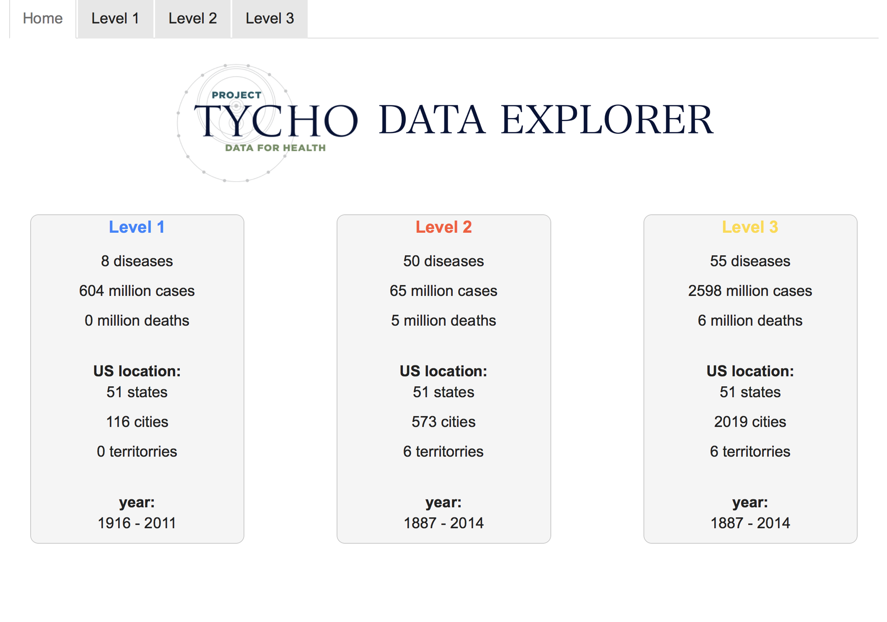

# Project Tycho Data Explorer 

Shiny_Tycho is a Shiny app for visualizing large public health data from levels L1, L2, L3 of [Project Tycho](https://www.tycho.pitt.edu). The app utilizes Shiny and Plotly to create different types of interactive plots for exploring spatial and temporal trends in the data. I also created another [app](https://github.com/alisonswu/shiny-Tycho_L1L2) for exploring the data at L1 and L2 level at fine granularity.  

## Screenshots
Here are some example screenshots from the app.
<p align="center">
  
  
  
  
</p>


## Usage

You will need RStudio and internet connection to run the app. Click [here](https://www.rstudio.com/home/) to install RStudio.

To launch the app, open RStudio and run the following code. 

```R
# install shiny package if not found
if(!"shiny" %in% installed.packages()){install.packages("shiny")}

library(shiny)
runGitHub("shiny-Tycho","alisonswu")
```
